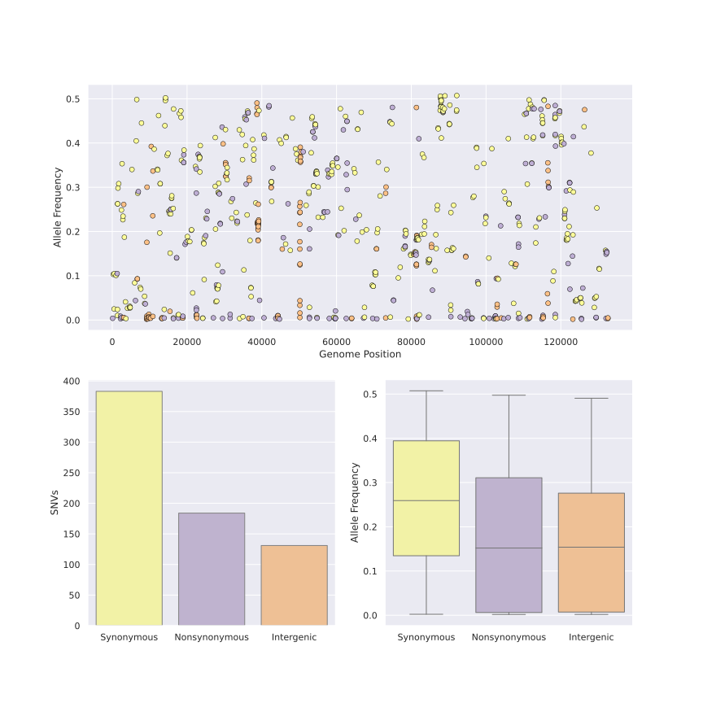

# Genomic Diversity in a Population of Spodoptera frugiperda Nucleopolyhedrovirus

This manuscript seeks to characterize the genetic diversity present in a natural population of *Spodoptera frugiperda* Multiple Nucleopolyhedrovirus (SfMNPV) isolate from Argentina. Our approach is based on High-Throughput Sequencing (HTS) through Illumina technology, which allow us to identify both Single Nucleotide Variants (SNV) and more complex Structural Variants (SV). 

## Genomic Analysis Pipeline

Great part of the data analysis was carried using the Snakemake workflow management system.
<!--- Insert Workflow graph here.-->
