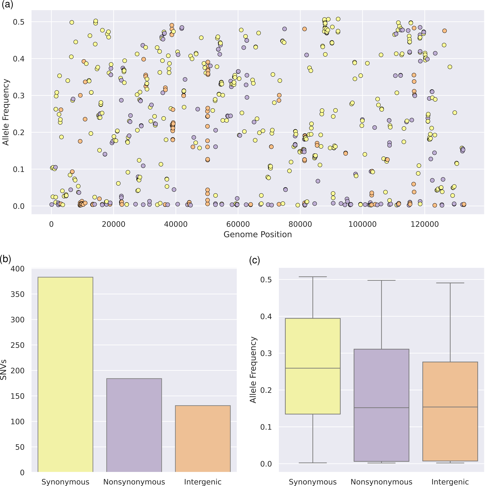
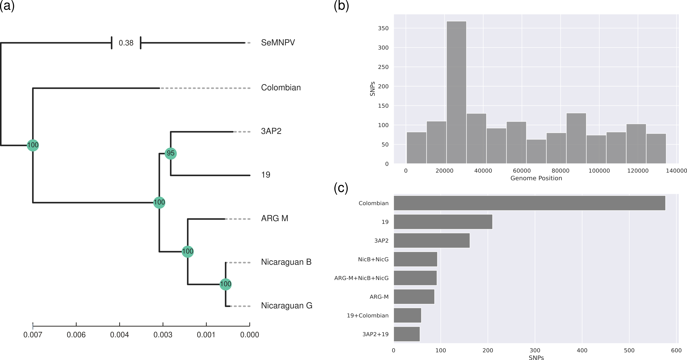
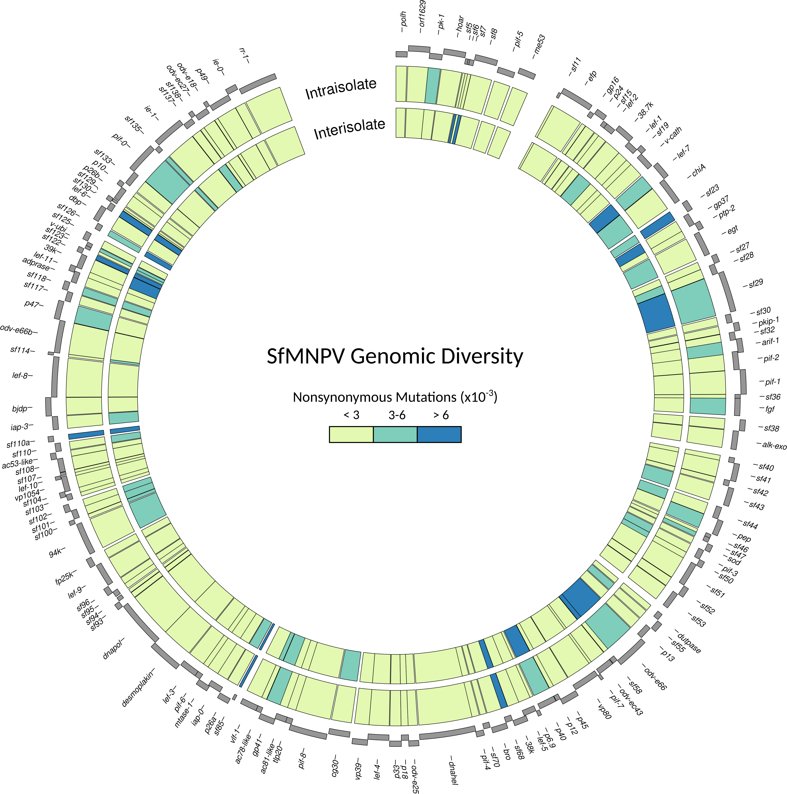
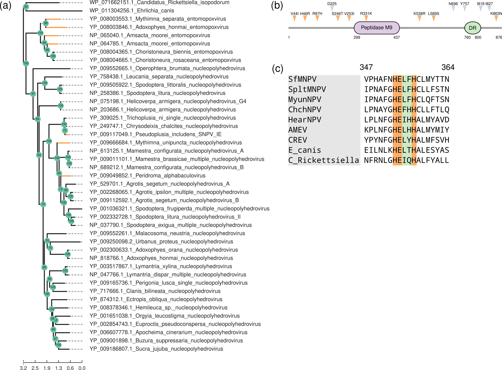

**Figure 1: Genome-wide diversity in the SfMNPV ARG-M isolate.** **(a)** Distribution of synonymous (yellow), nonsynonymous (violet) and intergenic (orange) iSNVs across the genome. **(b)** Number of iSNVs detected for each category. **(c)** Boxplot showing the allele frequency for each iSNV category.  

\hfill

**Figure 2: Genetic diversity present in SfMNPV isolates.** **(a)** Maximum likelihood phylogeny reconstructed from a whole-genome sequence alignment. Support values were computed using 1000 UltraFast Bootstrap replicates. *Spodoptera exigua* nucleopolyhedrovirus (SeMNPV) was selected as outgroup. **(b)** Histogram showing the number of SNPs per bin detected within the sequence alignment. The alignment was splitted into 13 bins, which correspond to 10.38 Kbp per bin. **(c)** Barplot showing the number of SNPs detected for each isolate and the combinations detected.  

\hfill

**Figure 3: Proteome diversity within SfMNPV.** For each coding region in SfMNPV the number of nonsynonymous variants was computed. The inner circle represents SNPs derived from isolates whole-genome sequence alignment, while the outer ring corresponds to the iSNVs detected within SfMNPV ARG-M.  

\hfill

**Figure 4: Sf29 Molecular Evolution.** **(a)** Maximum likelihood phylogeny of *sf29* orthologs. Support values were computed using 1000 UltraFast Bootstrap replicates. *E. canis* and *C. Rickettsiella* were included as outgroups. Branches experiencing positive selection, as detected by aBSREL, are colored in orange. **(b)** Sequence analysis of *sf29*. Sites under positive selection are marked in blue, while iSNV are depicted in orange. The peptidase M9 domain is colored violet and the disordered region is in green. **(c)** Sequence conservation of the peptidase activate site motif (HEXXH), extracted from the *sf29* sequence alignment.  

\hfill

**Supplementary Tables**  

\hfill

**Supplementary Table 1:** Annotated coding sequences for SfMNPV ARG-M.  

\hfill

**Supplementary Table 2:** Intrahost single nucleotide variants (iSNVs) detected with Lofreq.   

\hfill

**Supplementary Table 3:** Structural variants detected with both Delly and Lumpy.  

\hfill

**Supplementary Table 4:** Single nucleotide polymorphisms (SNPs) present in SfMNPV isolates.  

\hfill

\newpage

\newpage

\newpage

